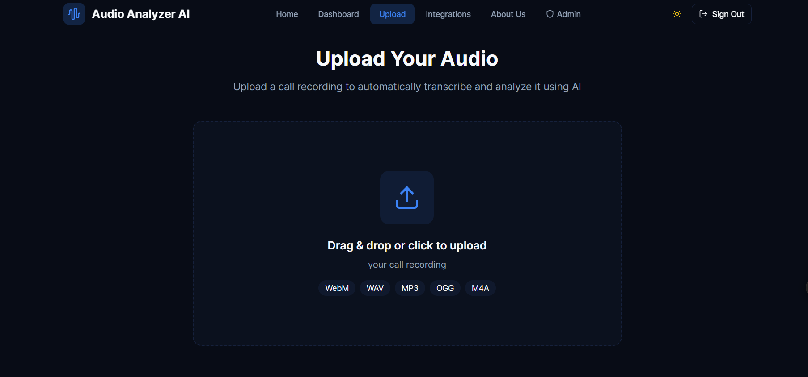
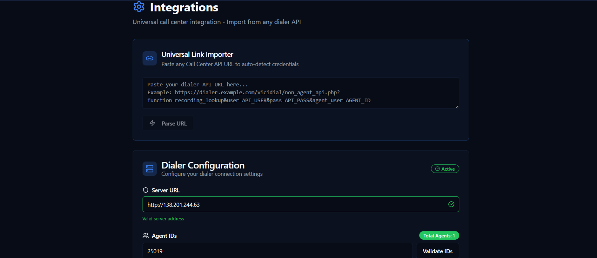
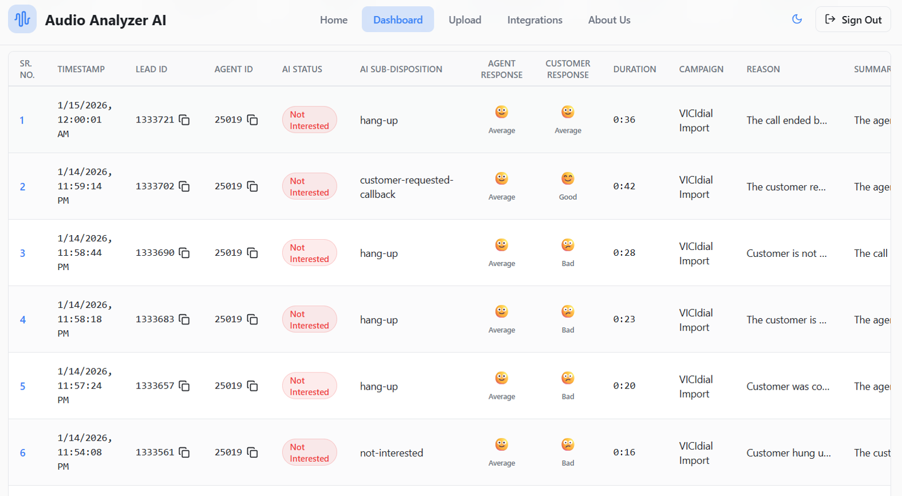
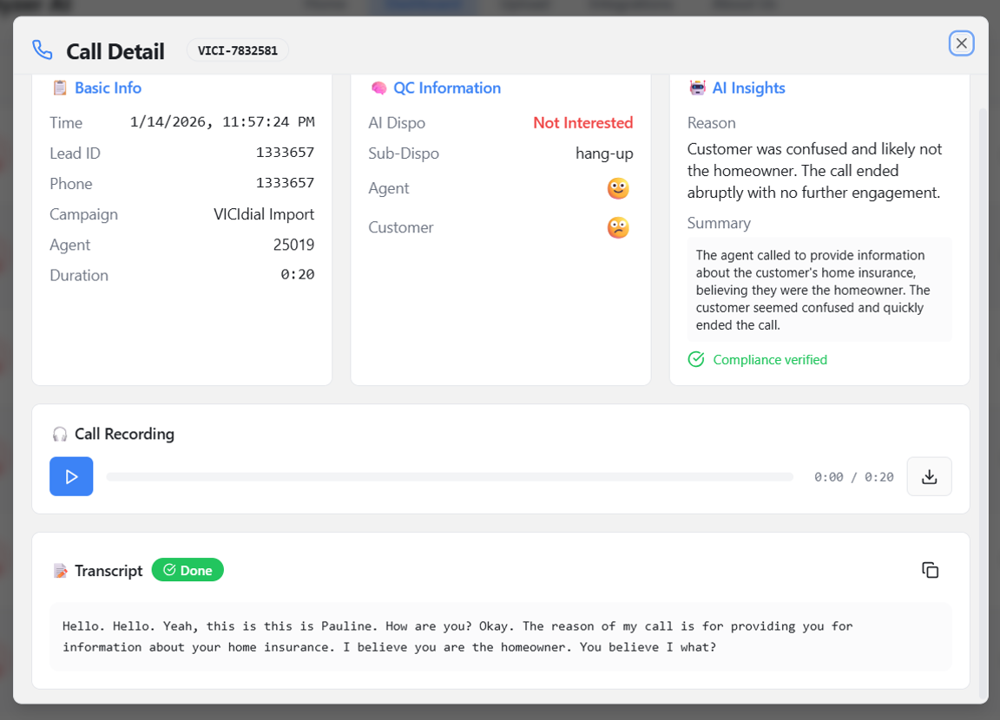
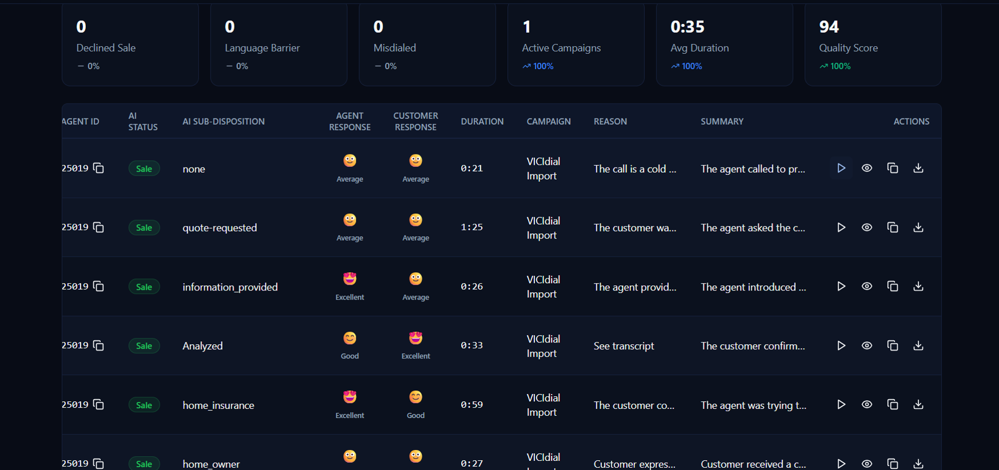

# Audio Analyzer AI

A modern web application for analyzing audio recordings with AI-powered insights and detailed call transcription.

## Getting Started

### Prerequisites

- Node.js & npm installed - [install with nvm](https://github.com/nvm-sh/nvm#installing-and-updating)

### Installation

```sh
# Step 1: Clone the repository
git clone https://github.com/SyedHassanRaza67/audio-analyzer-ai.git

# Step 2: Navigate to the project directory
cd audio-analyzer-ai

# Step 3: Install dependencies
npm install

# Step 4: Start the development server
npm run dev
```

## Technologies Used

This project is built with:

- **Vite** - Fast build tool and development server
- **TypeScript** - Type-safe JavaScript
- **React** - Modern UI library
- **shadcn-ui** - Beautiful UI components
- **Tailwind CSS** - Utility-first CSS framework

## Project Features

- **Audio Upload & Analysis** - Upload audio files and get AI-powered analysis
- **Automatic Transcription** - Converts speech to text with intelligent processing
- **Call Records Management** - Comprehensive table view with filtering and search
- **Vici Integration** - Syncs call data from Vici CRM system
- **Live Data Synchronization** - Real-time updates and live status indicators
- **Campaign Filtering** - Filter and organize calls by campaigns
- **Detailed Call Analytics** - View call details with transcription and metadata
- **Responsive Design** - Works seamlessly on desktop and mobile devices
- **Dark Mode Support** - Comfortable viewing in any lighting condition
- **Authentication** - Secure user authentication with login/registration
- **Admin Dashboard** - Statistics and overview of all call records

## API Integrations

- **Supabase** - Backend database and real-time data synchronization
- **Vici CRM** - Integration for syncing call records and campaign data
- **Audio Processing** - Handles audio file uploads and processing

## Key Technologies

### Frontend Libraries
- **React 18** - Modern UI framework
- **React Router** - Client-side routing
- **React Hook Form** - Efficient form management
- **Zod** - TypeScript-first schema validation

### UI & Styling
- **shadcn/ui** - High-quality React components
- **Radix UI** - Unstyled, accessible component library
- **Tailwind CSS** - Utility-first CSS framework
- **Framer Motion** - Smooth animations and transitions
- **Lucide React** - Modern icon library

### Data Management & Queries
- **TanStack Query** - Powerful data fetching and caching
- **Supabase JS SDK** - Backend client library
- **Recharts** - Composable charting library

### Development Tools
- **Vite** - Lightning-fast build tool
- **TypeScript** - Type-safe development
- **ESLint** - Code quality and consistency

## Screenshots





